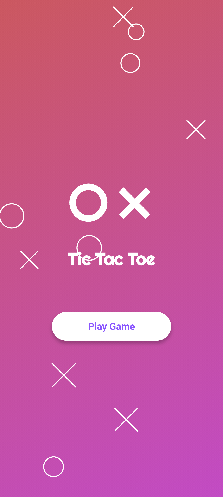
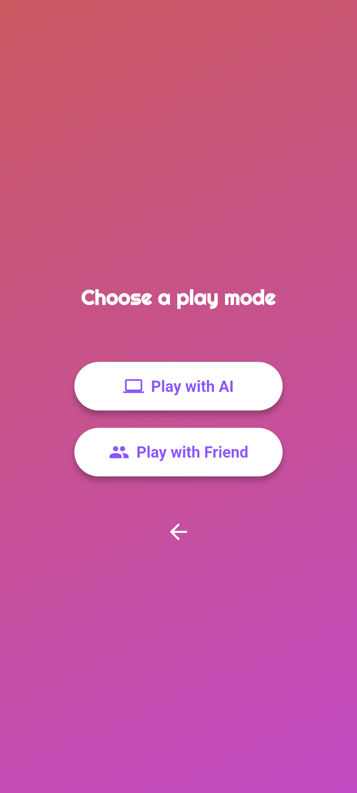
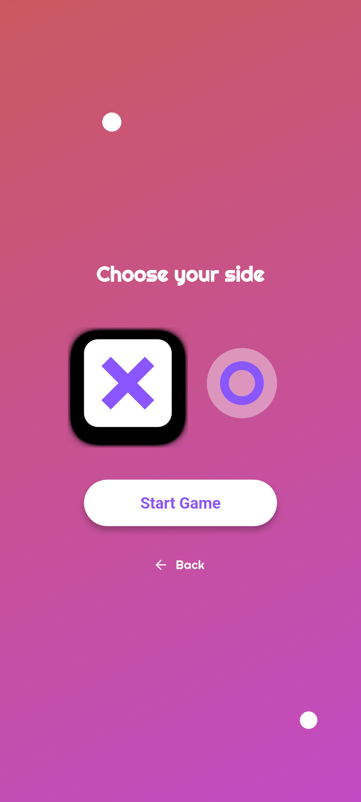
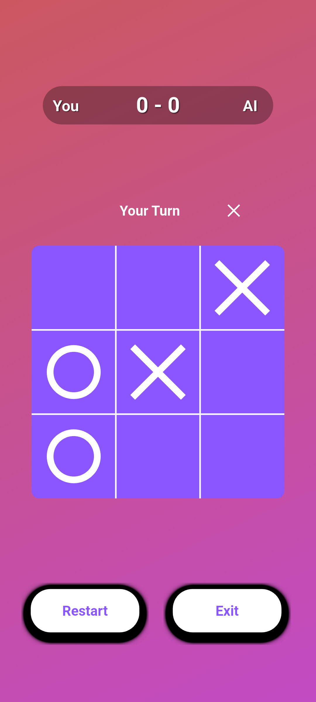
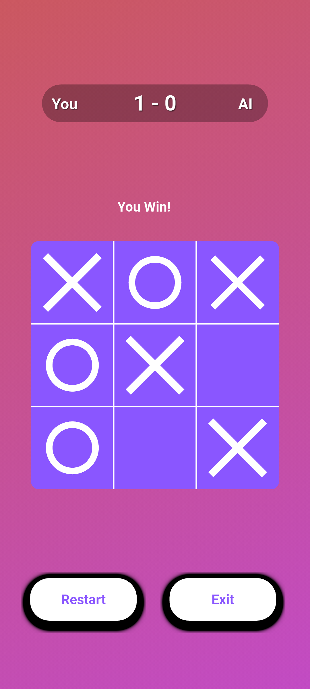
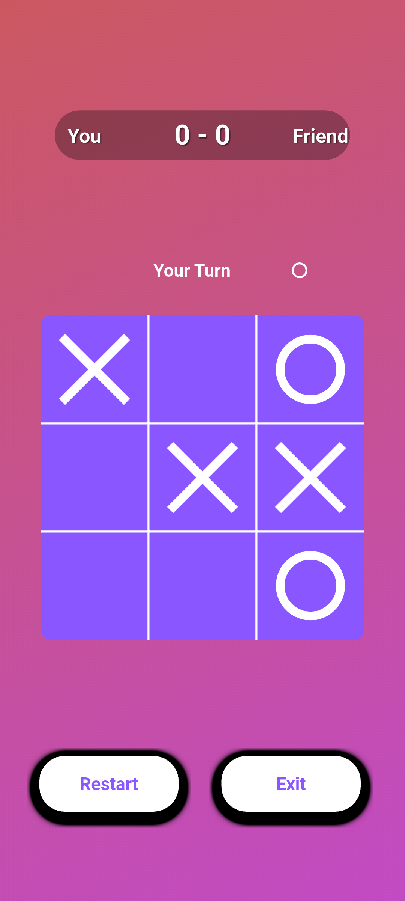

# 🎮 Tic-Tac-Toe Game

A beautiful Flutter-based Tic-Tac-Toe game with stunning particle effects and multiple game modes.

## 📸 Screenshots

<p align="center">
  
  
  
  
</p>

<p align="center">
  
  
</p>

## ✨ Features

- 🤖 **AI Mode** - Challenge yourself against an intelligent computer opponent
- 👥 **Friend Mode** - Play with friends locally on the same device
- 🎨 **Beautiful UI** - Gradient backgrounds with animated particle effects
- 🏆 **Score Tracking** - Keep track of wins and losses
- 📱 **Cross-Platform** - Runs on Android, iOS, Windows, Linux, and Web

## 🚀 Getting Started

### Prerequisites
- Flutter SDK (latest stable version)
- Dart SDK

### Installation

1. Clone the repository:
```bash
git clone <your-repo-url>
cd tttgame
```

2. Install dependencies:
```bash
flutter pub get
```

3. Run the app:
```bash
flutter run
```

## 🎯 How to Play

1. **Choose Game Mode**: Select either AI or Friend mode
2. **Pick Your Side**: Choose X or O (in AI mode, decide who goes first)
3. **Make Your Move**: Tap on any empty cell to place your symbol
4. **Win the Game**: Get three in a row (horizontally, vertically, or diagonally)

## 🛠️ Built With

- **Flutter** - UI framework
- **Flame** - Game engine for particle effects and animations
- **Dart** - Programming language

## 📱 Supported Platforms

- ✅ Android
- ✅ iOS  
- ✅ Windows
- ✅ Linux
- ✅ Web

## 🤝 Contributing

Contributions are welcome! Feel free to submit issues and pull requests.

## 📄 License

This project is open source and available under the [MIT License](LICENSE).
